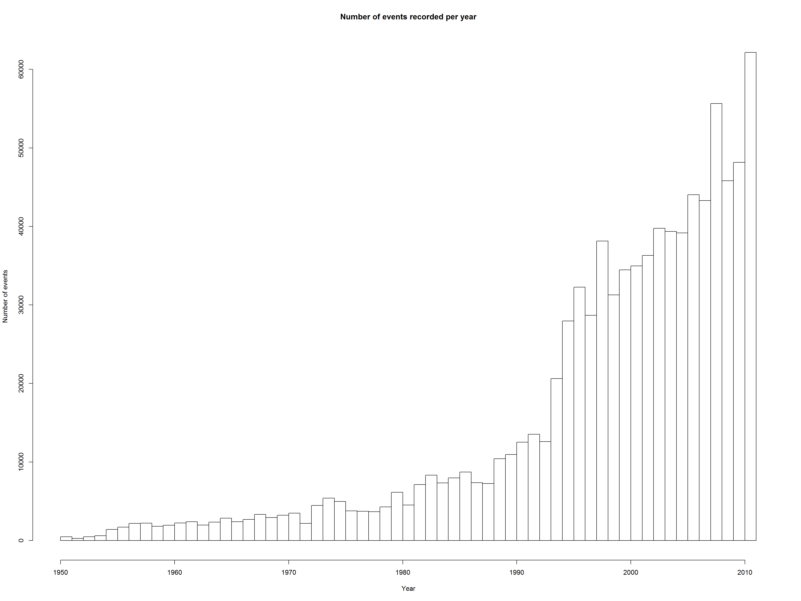
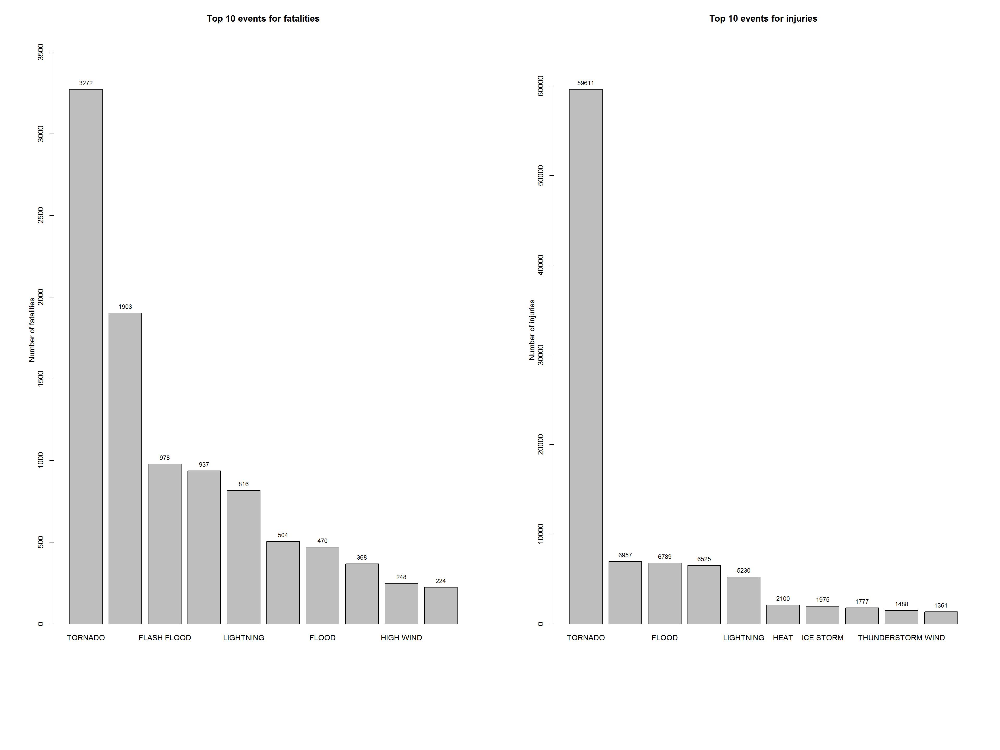
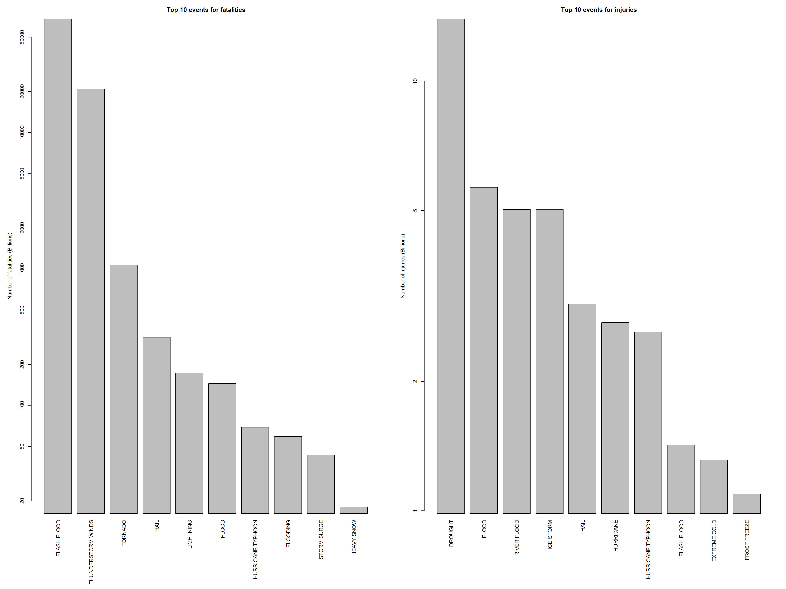

*Title:*   
#Major storms and weather events that causes most harmful to health and greatest impact on economic, in the United States (since 1970 - 2011)#

*Synopsis:*  
Immediately after the title, there should be a synopsis which describes and summarizes your analysis in at most 10 complete sentences.  


##Processing Data#  

The analysis was performed on [Storm Events Database]("http://www.ncdc.noaa.gov/stormevents/ftp.jsp"), provided by [National Climatic Data Center]("http://www.ncdc.noaa.gov/"). The data is from a comma-separated-value file available [here]("https://d396qusza40orc.cloudfront.net/repdata%2Fdata%2FStormData.csv.bz2"). There is also some documentation of the data available [here]("https://d396qusza40orc.cloudfront.net/repdata%2Fpeer2_doc%2Fpd01016005curr.pdf").  

Downloading data file

```r
#setting local working directory
setwd("C:/Data/devtools/Git/RepData_PeerAssessment2")
library(knitr)
library(ggplot2)
#suppressMessages to suppress warning/ messages
suppressMessages(library(dplyr))
#setting working directory for knit
opts_knit$set(base.dir = "C:/Data/devtools/Git/RepData_PeerAssessment2")
stdata <- NULL
```

```r
#Checking for file in current directory
if(!file.exists("PA2_StormData.bz2"))
{
        download.file("https://d396qusza40orc.cloudfront.net/repdata%2Fdata%2FStormData.csv.bz2",destfile = "PA2_StormData.bz2",mode = "wb")
}
```
Reading and checking data from file  

```r
#reading data from csv file
stdata <- read.csv(bzfile("PA2_StormData.bz2"))
#getting rows and columns count
colnms <- names(stdata)
#rows & columns
rws <- nrow(stdata); cls <- ncol(stdata)
```

Data from file:    
. Numer of rows **902297**   
. Number of columns **37**  

Filtering required columns from dataframe for analysis. Ploting histogram to understand the data available for each year in U.S. National Oceanic and Atmospheric Administration's (NOAA) storm database (from 1970-2011). 


```r
#getting required data for analysis
prcdata <- stdata
names(prcdata) <- toupper(names(prcdata))
#getting required columns
prcdata <- prcdata[,c("BGN_DATE", "EVTYPE", "FATALITIES", "INJURIES","PROPDMG","PROPDMGEXP","CROPDMG","CROPDMGEXP")]
#formatting date
prcdata <- mutate(prcdata, BGN_DATE = as.Date(as.character(prcdata$BGN_DATE), "%m/%d/%Y"))
#Starting year
minDate <- min(prcdata$BGN_DATE)
maxDate <- max(prcdata$BGN_DATE)
#adding year column
prcdata$YEAR <- as.integer(format(prcdata$BGN_DATE, "%Y"))

hist(prcdata$YEAR, breaks = 45, main="Number of events recorded per year", xlab="Year", ylab="Number of events")
```

 

```r
#unique(prcdata$EVTYPE)
```


Histogram results supporting the statement *The events in the database start in the year 1950 and end in November 2011. In the earlier years of the database there are generally fewer events recorded, most likely due to a lack of good records. More recent years should be considered more complete.*

Considerable measurements being collected from 1970 to 2011 by NOAA for major storms  and weather events.  
Event type (EVTYPE) values should be edited/updated with proper charecter sequences and trailing spaces to get proper counts and labels from the data.  


```r
#filtering data from 1970 to 2011
strmdata <- filter(prcdata, YEAR >= 1970)
#converting to lower case
evntlbls <- toupper(strmdata$EVTYPE)
## Replace all punct. characters with a space
#evntlbls <- gsub("(^[[:space:]]+|[[:space:]]+$)", "", evntlbls)
#evntlbls <- gsub("[[:blank:][:punct:]+]", " ", evntlbls)
#evntlbls <- gsub("^thunderstorm wind[:alnum:]", "thunderstorm wind", evntlbls)
#evntlbls <- gsub("^tstm wind[:alnum:]", "thunderstorm wind", evntlbls)
evntlbls <- gsub("(^[[:space:]]+|[[:space:]]+$) | [[:blank:][:punct:]+]"," ",evntlbls)
evntlbls <- gsub("^thunderstorm wind[:alnum:] | ^tstm wind[:alnum:]", "thunderstorm wind", evntlbls)
#updating data with updated labels
strmdata$EVTYPE <- evntlbls
#unique(strmdata$EVTYPE)
```

##Data Analysis  

Subsetting wheather events which causes most harmful to population health and greatest economic consequences events from the data.  

##Major Weather Eevents harmful to Population Health 

```r
#Getting harmful events data from dataframe
hdata <- filter(strmdata,strmdata$FATALITIES > 0 | strmdata$INJURIES > 0)
#harmful data rows count
nrow(hdata)
```

```
## [1] 19585
```

###Health Data Anasysis


```r
#Fatalities events counts
fatcounts <- aggregate(FATALITIES ~ EVTYPE,data=hdata,FUN=sum)
#InjuryEvents by aggregation
injcounts <- aggregate(INJURIES ~ EVTYPE,data=hdata,FUN=sum)
#Top ten records for FATALITIES and INJURIES
fatTop10 <- head(fatcounts[order(fatcounts$FATALITIES, decreasing = T), ], 10)
injTop10 <- head(injcounts[order(injcounts$INJURIES, decreasing = T), ], 10)
# Updating column names
colnames(fatTop10) <- c("Event", "Fatalities")
colnames(injTop10) <- c("Event", "Injuries")
```
##Results
###Health Data Top 10 records  
 . Fatal Events  
 . Injury Events  


```r
fatTop10
```

```
##              Event Fatalities
## 168        TORNADO       3272
## 27  EXCESSIVE HEAT       1903
## 36     FLASH FLOOD        978
## 61            HEAT        937
## 111      LIGHTNING        816
## 175      TSTM WIND        504
## 41           FLOOD        470
## 135    RIP CURRENT        368
## 82       HIGH WIND        248
## 2        AVALANCHE        224
```

```r
injTop10
```

```
##                 Event Injuries
## 168           TORNADO    59611
## 175         TSTM WIND     6957
## 41              FLOOD     6789
## 27     EXCESSIVE HEAT     6525
## 111         LIGHTNING     5230
## 61               HEAT     2100
## 105         ICE STORM     1975
## 36        FLASH FLOOD     1777
## 157 THUNDERSTORM WIND     1488
## 59               HAIL     1361
```

###Health Data plots


```r
par(mfrow = c(1, 2), mar = c(14, 6, 4, 3), mgp = c(2, 1, 0), cex = 0.9)

ylim <- c(0, 1.1*max(fatTop10$Fatalities))

fatalPlot <- barplot(fatTop10$Fatalities, names.arg = fatTop10$Event, main = 'Top 10 events for fatalities', ylab = 'Number of fatalities', ylim = ylim)
text(x = fatalPlot, y = fatTop10$Fatalities, label = round(fatTop10$Fatalities, 0), pos = 3, cex = 0.8)
ylim <- c(0, 1.1*max(injTop10$Injuries))

injuryPlot <- barplot(injTop10$Injuries, names.arg = injTop10$Event, main = 'Top 10 events for injuries', ylab = 'Number of injuries', ylim = ylim)
text(x = fatalPlot, y = injTop10$Injuries, label = round(injTop10$Injuries, 0), pos = 3, cex = 0.8)
```

 

##Economic Data Analysis


```r
#Economic consequence events data
edata <- filter(strmdata, strmdata$PROPDMG > 0 | strmdata$CROPDMG > 0)
#economic data rows count
nrow(edata)
```

```
## [1] 235473
```


```r
#Function to convert damage amount unit:
# h -> hundred, k -> thousand, m -> million, b -> billion
convertCurrUnit <- function(e) 
{
        if (e %in% c('h', 'H')){
                return(2)
        } else if (e %in% c('k', 'K')) {
                return(3)
        } else if (e %in% c('m', 'M')) {
                return(6)
        } else if (e %in% c('b', 'B')) {
                return(9)
        } else if (!is.na(as.numeric(e))) {# if a digit
                return(as.numeric(e))
        } else if (e %in% c('', '-', '?', '+')) {
                return(0)
        } else {
                stop("Not valid.")
        }
}
```

###Calculating Property and Corp damage dxpenses


```r
#Getting property damage
prdamage <- sapply(edata$PROPDMGEXP, FUN=convertCurrUnit)
edata$PROPDMG <- edata$PROPDMG * (10 ** prdamage)
#Getting corp damage 
crdamage <- sapply(edata$CROPDMGEXP, FUN=convertCurrUnit)
edata$CROPDMG <- edata$CROPDMG * (10 ** crdamage)
```


```r
# Fatal events
prcounts <- aggregate(PROPDMG ~ EVTYPE,data=edata,FUN=sum)
crcounts <- aggregate(CROPDMG ~ EVTYPE,data=edata,FUN=sum)
# Events caused most economic expenses
prevntTop10 <- head(prcounts[order(prcounts$PROPDMG, decreasing = T), ], 10)
crevntTop10 <- head(crcounts[order(crcounts$CROPDMG, decreasing = T), ], 10)

# Updating column names
colnames(prevntTop10) <- c("Event", "propDMG")
colnames(crevntTop10) <- c("Event", "cropDMG")
```
###Reselts  
###Economic Data Top 10 records  
 . Property damage
 . Corp damage  


```r
prevntTop10
```

```
##                  Event      propDMG
## 52         FLASH FLOOD 6.820237e+13
## 297 THUNDERSTORM WINDS 2.086532e+13
## 322            TORNADO 1.073677e+12
## 100               HAIL 3.157558e+11
## 203          LIGHTNING 1.729433e+11
## 65               FLOOD 1.446577e+11
## 178  HURRICANE/TYPHOON 6.930584e+10
## 74            FLOODING 5.920825e+10
## 271        STORM SURGE 4.332354e+10
## 132         HEAVY SNOW 1.793259e+10
```

```r
crevntTop10 
```

```
##                 Event     cropDMG
## 34            DROUGHT 13972566000
## 65              FLOOD  5661968450
## 237       RIVER FLOOD  5029459000
## 187         ICE STORM  5022113500
## 100              HAIL  3025974480
## 170         HURRICANE  2741910000
## 178 HURRICANE/TYPHOON  2607872800
## 52        FLASH FLOOD  1421317100
## 47       EXTREME COLD  1312973000
## 86       FROST/FREEZE  1094186000
```
###Economic data plots


```r
par(mfrow = c(1, 2), mar = c(12, 5, 3, 2), mgp = c(3, 1, 0), cex = 0.8, las = 3)

prdmgplot <- barplot((prevntTop10$propDMG/1000000000), names.arg = prevntTop10$Event, main = 'Top 10 events for fatalities', ylab = 'Number of fatalities (Billions)', log="y")
crdmgplot <- barplot((crevntTop10$cropDMG/1000000000), names.arg = crevntTop10$Event, main = 'Top 10 events for injuries', ylab = 'Number of injuries (Billions)', log="y")
```

 

*Execute below script in commandline (or R console) to generate plot images and place them in './figure' folder  
knit2html("PA2_template.Rmd", "PA2_template.html")*  

